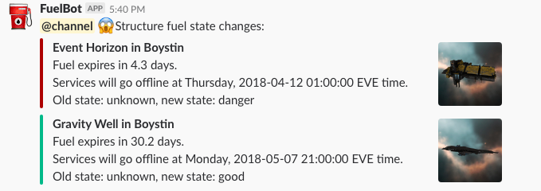

# EVE FuelBot

This Ruby application can be used to notify Slack channels of the _fuelling
state_ of a corporation's Upwell structures. It is stateful, so that it can
be run often but only report state changes.

A structure's fuelling state is one of the following:

* `unknown` is regarded as the previous state for any structures not
  already present in the state file.

* `danger` means that the structure will run out of fuel in a week or less.

* `warning` means that the structure will run out of fuel in more than a week,
  but not more than two weeks.

* `good` means that the structure has enough fuel to last at least two weeks.

These arbitrary thresholds are currently hard-coded in `fuelbot.rb`.

## Configuration

### SSO and ESI Configuration

The application takes its configuration from `config.yaml`. This contains
various secrets, so I haven't included the one I'm using in the repository.
Instead, `example-config.yaml` can be used as a template.

You need to have registered a third-party application with CCP
at <https://developers.eveonline.com>; this will give
you the `client_id` and `client_secret` values to put in the configuration.
Your application's registration should include at least the following scopes:

* esi-corporations.read_structures.v1

Once you have a registered application, you need to manually use the EVE SSO
to log in as a character from the target corporation with the "Station Manager"
role, and request those same scopes. If you don't know how to do this, CCP
have [a step-by-step article](https://developers.eveonline.com/blog/article/sso-to-authenticated-calls)
covering the process.

The resulting refresh token goes into the
`refresh_token` configuration item.

### Operational Configuration

The `systems` configuration item is a list of solar system names; the
application will only report on structures anchored in these systems.

The application tracks the previous fuelling state of structures so that it can
notify the Slack channel only when the state changes. This state is held by
default in the file `state.yaml`, but if you'd like to put the state file
somewhere else (for example so that you can mount it into a Docker container)
then its location is taken from the `statefile` configuration item.

If any of the notifications are for anything other than a `good` state,
the message will be an `@channel` ping.

### Slack Configuration

If there are some state changes to notify (within the given solar systems) then
Slack's "incoming webhooks" facility is used to make a nice notification with an
attachment state change. The details are nested under a `slack` configuration
item:

* The URL you get from your webhook configuration goes in `webhook_url`

* `channel` can be a public or private channel prefixed by `#`, e.g.,
  `'#fuel-panics'`. It can also be a user name prefixed by `@`.

## Setup and Execution

Set up as follows:

```bash
$ bundle install --path vendor
```

Execute like this:

```bash
$ bundle exec ruby fuelbot.rb
```

Over in Slack, you might see something like this:



## Future Plans

The thresholds between fuelling states should be taken from the configuration
file.

It's possible for Slack messages to report times in the local timezone of each
reader, and this seems like a good approach (possibly as well as the EVE time
currently reported).

For my own deployment, I am going to use Docker and once that is done I will
add appropriate support here.
